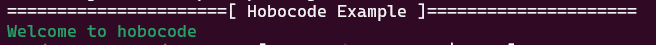
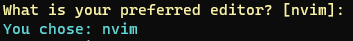

# Hobocode

Hobocode is a pty-aware colorized printing library intended for use in CLI
applications for human consumption and UX rather than structured outputs.

Uses [go-pretty v6](https://github.com/jedib0t/go-pretty) for colors and Sprinting.

```go
	hobocode.Header("Hobocode Example")
	hobocode.Success("Welcome to hobocode")
```




The [underlying functions](coloring.go) can be used if you are working with custom *os.File's or you can use the lazy opinionated helpers like 

### Plain
`hobocode.Warn("Something might be going wrong")`

### Formatted
`hobocode.Debugf("Output: %v", ret.Body())`

### Indented
`hobocode.Ierror(2, "Something went terribly wrong")`

### Indented and Formatted
`hobocode.Iinfof(1, "Date: %s", time.Now().Format("2006/01/02"))`


# Example

See [examples](examples/)

```
import (
    "github.com/asciifaceman/hobocode"
)

func main() {
    userinput := hobocode.Input("nvim", "What is your preferred editor?")

    hobocode.Notef("You chose: %s", userinput)
}
```

